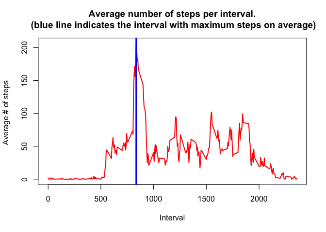

# Reproducible Research: Peer Assessment 1


## Loading and preprocessing the data

```r
f<-unzip("activity.zip")
data<-read.csv(f)
rm(f)
data$dates<-strptime(data$date, "%Y-%m-%d")
uniqueDates <- unique(data$dates)
uniqueIntervals <- unique(data$interval)
```


## What is mean total number of steps taken per day?
### Data preparation

```r
stepsSpl<-split(data$steps, data$dates$yday)
sumStepsPerDay<-sapply(stepsSpl, sum, na.rm=TRUE)
```

### Total number of steps taken each day

```r
plot(uniqueDates, sumStepsPerDay, main="Histogram of steps per day", xlab="Date", ylab="Frequency", type="h", lwd=4, col="blue")
```

<!-- -->

### Mean and median steps per day

```r
meanStepsPerDay <- sapply(stepsSpl, mean, na.rm=TRUE)
meanDataFrame <- data.frame(date=uniqueDates, meanStepsPerDay=meanStepsPerDay, row.names=NULL)
medianStepsPerDay <- sapply(stepsSpl, median, na.rm=TRUE)
medianDataFrame <- data.frame(date=uniqueDates, medianStepsPerDay=medianStepsPerDay, row.names=NULL)
```

#### Mean steps per day

```r
print(meanDataFrame)
```

```
##          date meanStepsPerDay
## 1  2012-10-01             NaN
## 2  2012-10-02       0.4375000
## 3  2012-10-03      39.4166667
## 4  2012-10-04      42.0694444
## 5  2012-10-05      46.1597222
## 6  2012-10-06      53.5416667
## 7  2012-10-07      38.2465278
## 8  2012-10-08             NaN
## 9  2012-10-09      44.4826389
## 10 2012-10-10      34.3750000
## 11 2012-10-11      35.7777778
## 12 2012-10-12      60.3541667
## 13 2012-10-13      43.1458333
## 14 2012-10-14      52.4236111
## 15 2012-10-15      35.2048611
## 16 2012-10-16      52.3750000
## 17 2012-10-17      46.7083333
## 18 2012-10-18      34.9166667
## 19 2012-10-19      41.0729167
## 20 2012-10-20      36.0937500
## 21 2012-10-21      30.6284722
## 22 2012-10-22      46.7361111
## 23 2012-10-23      30.9652778
## 24 2012-10-24      29.0104167
## 25 2012-10-25       8.6527778
## 26 2012-10-26      23.5347222
## 27 2012-10-27      35.1354167
## 28 2012-10-28      39.7847222
## 29 2012-10-29      17.4236111
## 30 2012-10-30      34.0937500
## 31 2012-10-31      53.5208333
## 32 2012-11-01             NaN
## 33 2012-11-02      36.8055556
## 34 2012-11-03      36.7048611
## 35 2012-11-04             NaN
## 36 2012-11-05      36.2465278
## 37 2012-11-06      28.9375000
## 38 2012-11-07      44.7326389
## 39 2012-11-08      11.1770833
## 40 2012-11-09             NaN
## 41 2012-11-10             NaN
## 42 2012-11-11      43.7777778
## 43 2012-11-12      37.3784722
## 44 2012-11-13      25.4722222
## 45 2012-11-14             NaN
## 46 2012-11-15       0.1423611
## 47 2012-11-16      18.8923611
## 48 2012-11-17      49.7881944
## 49 2012-11-18      52.4652778
## 50 2012-11-19      30.6979167
## 51 2012-11-20      15.5277778
## 52 2012-11-21      44.3993056
## 53 2012-11-22      70.9270833
## 54 2012-11-23      73.5902778
## 55 2012-11-24      50.2708333
## 56 2012-11-25      41.0902778
## 57 2012-11-26      38.7569444
## 58 2012-11-27      47.3819444
## 59 2012-11-28      35.3576389
## 60 2012-11-29      24.4687500
## 61 2012-11-30             NaN
```

#### Median steps per day

```r
print(medianDataFrame)
```

```
##          date medianStepsPerDay
## 1  2012-10-01                NA
## 2  2012-10-02                 0
## 3  2012-10-03                 0
## 4  2012-10-04                 0
## 5  2012-10-05                 0
## 6  2012-10-06                 0
## 7  2012-10-07                 0
## 8  2012-10-08                NA
## 9  2012-10-09                 0
## 10 2012-10-10                 0
## 11 2012-10-11                 0
## 12 2012-10-12                 0
## 13 2012-10-13                 0
## 14 2012-10-14                 0
## 15 2012-10-15                 0
## 16 2012-10-16                 0
## 17 2012-10-17                 0
## 18 2012-10-18                 0
## 19 2012-10-19                 0
## 20 2012-10-20                 0
## 21 2012-10-21                 0
## 22 2012-10-22                 0
## 23 2012-10-23                 0
## 24 2012-10-24                 0
## 25 2012-10-25                 0
## 26 2012-10-26                 0
## 27 2012-10-27                 0
## 28 2012-10-28                 0
## 29 2012-10-29                 0
## 30 2012-10-30                 0
## 31 2012-10-31                 0
## 32 2012-11-01                NA
## 33 2012-11-02                 0
## 34 2012-11-03                 0
## 35 2012-11-04                NA
## 36 2012-11-05                 0
## 37 2012-11-06                 0
## 38 2012-11-07                 0
## 39 2012-11-08                 0
## 40 2012-11-09                NA
## 41 2012-11-10                NA
## 42 2012-11-11                 0
## 43 2012-11-12                 0
## 44 2012-11-13                 0
## 45 2012-11-14                NA
## 46 2012-11-15                 0
## 47 2012-11-16                 0
## 48 2012-11-17                 0
## 49 2012-11-18                 0
## 50 2012-11-19                 0
## 51 2012-11-20                 0
## 52 2012-11-21                 0
## 53 2012-11-22                 0
## 54 2012-11-23                 0
## 55 2012-11-24                 0
## 56 2012-11-25                 0
## 57 2012-11-26                 0
## 58 2012-11-27                 0
## 59 2012-11-28                 0
## 60 2012-11-29                 0
## 61 2012-11-30                NA
```

## What is the average daily activity pattern?

```r
intervalSplit <- split(data$steps, data$interval)
averageStepsPerInterval <- sapply(intervalSplit, mean, na.rm=TRUE)
plot(uniqueIntervals, averageStepsPerInterval, type="l",main="Average number of steps per interval.\n (blue line indicates the interval with maximum steps on average)", xlab="Interval", ylab="Average # of steps ", lwd=2, col="red")
maxIntervalDays <- max(averageStepsPerInterval, na.rm=TRUE)
maxIndex <- as.numeric(which(averageStepsPerInterval == maxIntervalDays))
maxInterval <- uniqueIntervals[maxIndex]
abline(v=maxInterval, col="blue", lwd=3)
```

<!-- -->

## Imputing missing values
### Amount of missing values

```r
isna<- is.na(data$steps)
print(sum(isna))
```

```
## [1] 2304
```

### Dealing with missing values - replace NAs with means

```r
# Initially replace NaNs in mean steps per day with 0s
meanStepsPerDay[is.nan(meanStepsPerDay)]<-0
# To deal with NaNs we will replace them with means. To do that
# - create a vector with mean values for each day
meanValues <- rep(meanStepsPerDay, length(data$steps)/length(meanStepsPerDay))
# - Create new dataset.
dataNew<-data
# Now replace these values with their corresponding mean
dataNew$steps[is.na(data$steps)] <- meanValues[is.na(data$steps)]
```

### Histograms to compare of the total number of steps taken each day before and after missing values are imputed

```r
if(!require(ggplot2))
  stop("you need to install ggplot2")
```

```
## Loading required package: ggplot2
```

```r
if(!require(ggplot2))
  stop("you need to install gridextra")
stepsSplNew<-split(dataNew$steps, dataNew$dates$yday)
sumStepsPerDayNew<-sapply(stepsSplNew, sum, na.rm=TRUE)
library(ggplot2)
p<-ggplot(data=data.frame(uniqueDates, sumStepsPerDay), aes(x=uniqueDates, y=sumStepsPerDay))+geom_bar(stat="identity")+labs(y = "Steps per day", x="Dates", title="Steps per day\nincluding unknown values")
p2<-ggplot(data=data.frame(uniqueDates, sumStepsPerDayNew), aes(x=uniqueDates, y=sumStepsPerDayNew))+geom_bar(stat="identity")+labs(y = "Steps per day", x="Dates", title="Steps per day;\nunknown values replaced\nwith mean")
library(gridExtra)
grid.arrange(p, p2, ncol=2)
```

<!-- -->

### Mean and median steps per day with missing values imputed

```r
meanStepsPerDayNew <- sapply(stepsSplNew, mean, na.rm=TRUE)
meanDataFrameNew <- data.frame(date=uniqueDates, meanStepsPerDay=meanStepsPerDayNew, row.names=NULL)
medianStepsPerDayNew <- sapply(stepsSplNew, median, na.rm=TRUE)
medianDataFrameNew <- data.frame(date=uniqueDates, medianStepsPerDay=medianStepsPerDayNew, row.names=NULL)
```

#### Mean steps per day (with NaNs replaced with means)

```r
print(meanDataFrameNew)
```

```
##          date meanStepsPerDay
## 1  2012-10-01      32.3355276
## 2  2012-10-02       0.4375000
## 3  2012-10-03      39.4166667
## 4  2012-10-04      42.0694444
## 5  2012-10-05      46.1597222
## 6  2012-10-06      53.5416667
## 7  2012-10-07      38.2465278
## 8  2012-10-08      32.2632378
## 9  2012-10-09      44.4826389
## 10 2012-10-10      34.3750000
## 11 2012-10-11      35.7777778
## 12 2012-10-12      60.3541667
## 13 2012-10-13      43.1458333
## 14 2012-10-14      52.4236111
## 15 2012-10-15      35.2048611
## 16 2012-10-16      52.3750000
## 17 2012-10-17      46.7083333
## 18 2012-10-18      34.9166667
## 19 2012-10-19      41.0729167
## 20 2012-10-20      36.0937500
## 21 2012-10-21      30.6284722
## 22 2012-10-22      46.7361111
## 23 2012-10-23      30.9652778
## 24 2012-10-24      29.0104167
## 25 2012-10-25       8.6527778
## 26 2012-10-26      23.5347222
## 27 2012-10-27      35.1354167
## 28 2012-10-28      39.7847222
## 29 2012-10-29      17.4236111
## 30 2012-10-30      34.0937500
## 31 2012-10-31      53.5208333
## 32 2012-11-01      32.0149498
## 33 2012-11-02      36.8055556
## 34 2012-11-03      36.7048611
## 35 2012-11-04      32.4504726
## 36 2012-11-05      36.2465278
## 37 2012-11-06      28.9375000
## 38 2012-11-07      44.7326389
## 39 2012-11-08      11.1770833
## 40 2012-11-09      32.3078945
## 41 2012-11-10      32.8706718
## 42 2012-11-11      43.7777778
## 43 2012-11-12      37.3784722
## 44 2012-11-13      25.4722222
## 45 2012-11-14      32.9865210
## 46 2012-11-15       0.1423611
## 47 2012-11-16      18.8923611
## 48 2012-11-17      49.7881944
## 49 2012-11-18      52.4652778
## 50 2012-11-19      30.6979167
## 51 2012-11-20      15.5277778
## 52 2012-11-21      44.3993056
## 53 2012-11-22      70.9270833
## 54 2012-11-23      73.5902778
## 55 2012-11-24      50.2708333
## 56 2012-11-25      41.0902778
## 57 2012-11-26      38.7569444
## 58 2012-11-27      47.3819444
## 59 2012-11-28      35.3576389
## 60 2012-11-29      24.4687500
## 61 2012-11-30      32.2280213
```

#### Median steps per day (with NaNs replaced with means)

```r
print(medianDataFrameNew)
```

```
##          date medianStepsPerDay
## 1  2012-10-01          36.09375
## 2  2012-10-02           0.00000
## 3  2012-10-03           0.00000
## 4  2012-10-04           0.00000
## 5  2012-10-05           0.00000
## 6  2012-10-06           0.00000
## 7  2012-10-07           0.00000
## 8  2012-10-08          36.09375
## 9  2012-10-09           0.00000
## 10 2012-10-10           0.00000
## 11 2012-10-11           0.00000
## 12 2012-10-12           0.00000
## 13 2012-10-13           0.00000
## 14 2012-10-14           0.00000
## 15 2012-10-15           0.00000
## 16 2012-10-16           0.00000
## 17 2012-10-17           0.00000
## 18 2012-10-18           0.00000
## 19 2012-10-19           0.00000
## 20 2012-10-20           0.00000
## 21 2012-10-21           0.00000
## 22 2012-10-22           0.00000
## 23 2012-10-23           0.00000
## 24 2012-10-24           0.00000
## 25 2012-10-25           0.00000
## 26 2012-10-26           0.00000
## 27 2012-10-27           0.00000
## 28 2012-10-28           0.00000
## 29 2012-10-29           0.00000
## 30 2012-10-30           0.00000
## 31 2012-10-31           0.00000
## 32 2012-11-01          35.93576
## 33 2012-11-02           0.00000
## 34 2012-11-03           0.00000
## 35 2012-11-04          36.17014
## 36 2012-11-05           0.00000
## 37 2012-11-06           0.00000
## 38 2012-11-07           0.00000
## 39 2012-11-08           0.00000
## 40 2012-11-09          35.93576
## 41 2012-11-10          36.09375
## 42 2012-11-11           0.00000
## 43 2012-11-12           0.00000
## 44 2012-11-13           0.00000
## 45 2012-11-14          36.09375
## 46 2012-11-15           0.00000
## 47 2012-11-16           0.00000
## 48 2012-11-17           0.00000
## 49 2012-11-18           0.00000
## 50 2012-11-19           0.00000
## 51 2012-11-20           0.00000
## 52 2012-11-21           0.00000
## 53 2012-11-22           0.00000
## 54 2012-11-23           0.00000
## 55 2012-11-24           0.00000
## 56 2012-11-25           0.00000
## 57 2012-11-26           0.00000
## 58 2012-11-27           0.00000
## 59 2012-11-28           0.00000
## 60 2012-11-29           0.00000
## 61 2012-11-30          35.93576
```

## Are there differences in activity patterns between weekdays and weekends?
### Prepare datasets to compare

```r
clwdays<-rep(2, length(data$dates))
clwdays[data$dates$wday>=1 & data$dates$wday<=5]<-1
dataNew$dateType<-factor(clwdays, levels=c(1,2), labels=c("Weekdays", "Weekends"))
dataNewWeekdays <- dataNew[dataNew$dateType == "Weekdays", ]
dataNewWeekends <- dataNew[dataNew$dateType == "Weekends", ]

dataNewSplitWeekdays <- split(dataNewWeekdays$steps, dataNewWeekdays$interval)
dataNewSplitWeekends <- split(dataNewWeekends$steps, dataNewWeekends$interval)

# Find the average for each interval
meanStepsPerWeekdayInterval <- sapply(dataNewSplitWeekdays, mean)
meanStepsPerWeekendInterval <- sapply(dataNewSplitWeekends, mean)
```

### Average number of steps taken per 5-minute interval across weekdays and weekends

```r
par(mfcol=c(2,1))
plot(uniqueIntervals, meanStepsPerWeekdayInterval, type="l",
     main="Average number of steps - weekdays", 
     xlab="Interval", ylab="Average # of steps", 
     lwd=2, col="blue")
plot(uniqueIntervals, meanStepsPerWeekendInterval, type="l",
     main="Average number of steps - weekends", 
     xlab="Interval", ylab="Average # of steps", 
     lwd=2, col="red")
```

<!-- -->
